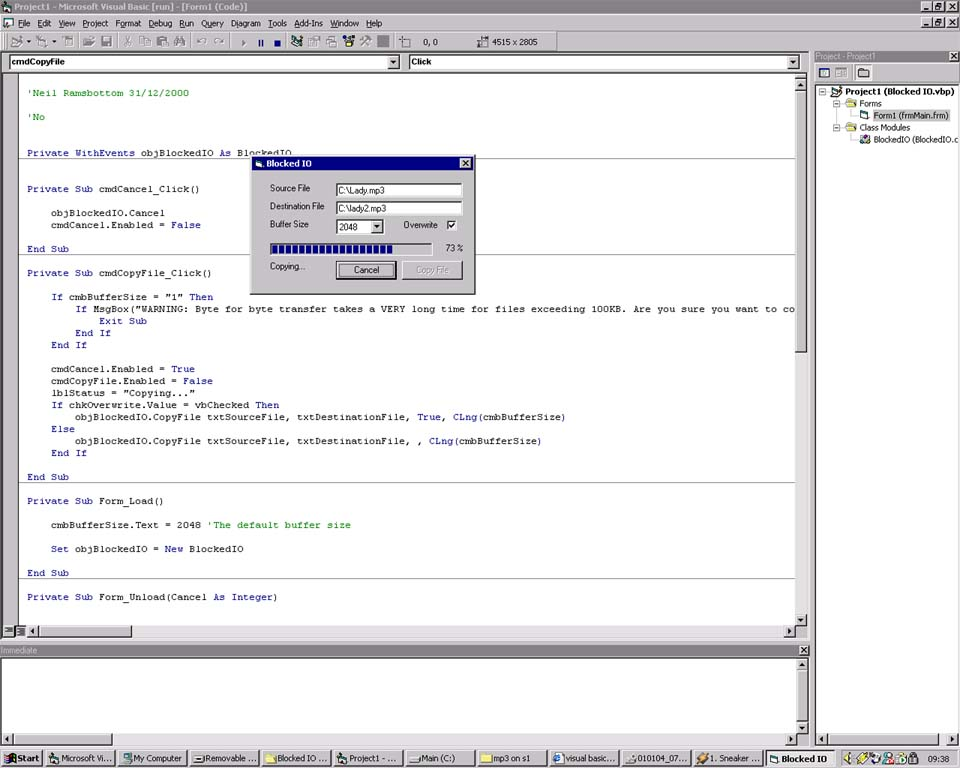



## Blocked File IO

### Description

This code demonstrates the basics behind blocked IO.

This is commonly used when copying files.
 
### More Info
 
The size of the buffer greatly affects the transfer speed. The bigger the better.

             |
---                |---
**Submitted On**   |2001-01-04 09:22:58
**By**             |[Neil Ramsbottom](https://github.com/Planet-Source-Code/PSCIndex/blob/master/ByAuthor/neil-ramsbottom.md)
**Level**          |Intermediate
**User Rating**    |4.4 (40 globes from 9 users)
**Compatibility**  |VB 6\.0
**Category**       |[Files/ File Controls/ Input/ Output](https://github.com/Planet-Source-Code/PSCIndex/blob/master/ByCategory/files-file-controls-input-output__1-3.md)
**World**          |[Visual Basic](https://github.com/Planet-Source-Code/PSCIndex/blob/master/ByWorld/visual-basic.md)
**Archive File**   |[CODE\_UPLOAD13349142001\.zip](https://github.com/Planet-Source-Code/neil-ramsbottom-blocked-file-io__1-14103/archive/master.zip)

